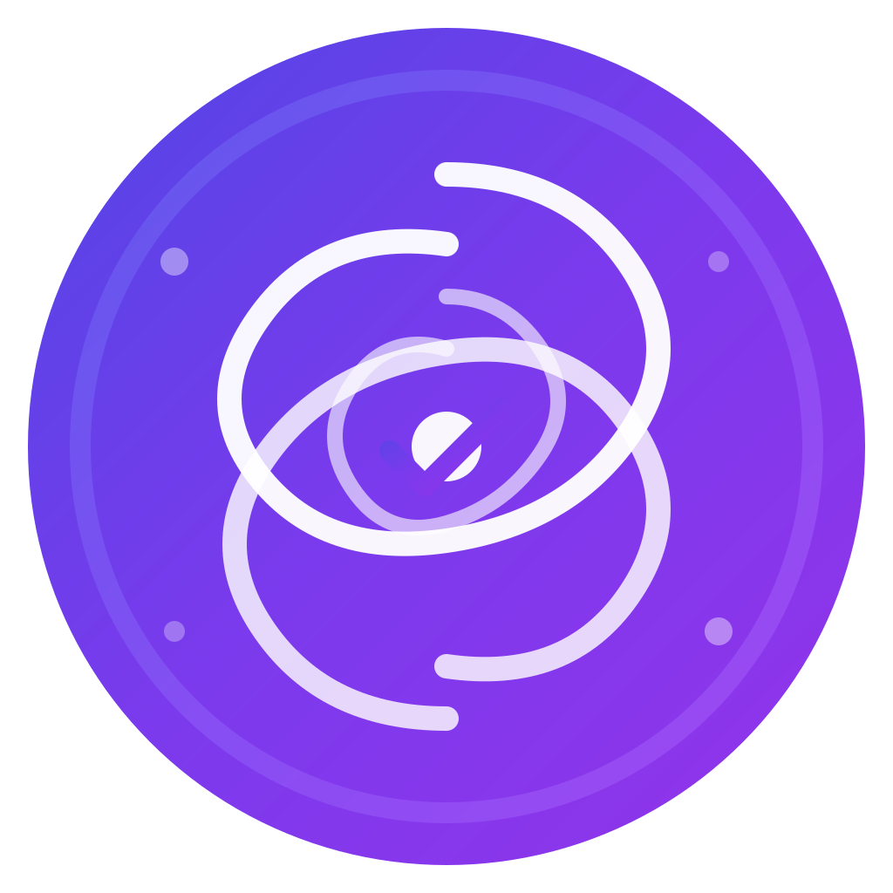

# Vortex

<p align="center">
  
</p>

<p align="center">
  A macOS floating task supervisor & activity monitor with edge-docking behavior inspired by Dynamic Island
</p>

<p align="center">
  
  
  
</p>

---

## Features

### Floating Capsule Window
- **Edge-docking**: Slides to screen edges and collapses into a compact capsule
- **Hover to expand**: Automatically expands when hovering over the docked capsule
- **Smooth animations**: Fluid transitions between expanded and collapsed states

### Task Management
- Create, complete, and delete tasks with due dates
- Automatic reminder notifications (hourly, daily, weekly)
- Task priority support (urgent, high, medium, low)
- Overdue task tracking with visual indicators

### Activity Monitoring
- Real-time monitoring of running applications
- Quick activation of recent apps
- Browser tab monitoring for Safari and Chrome
- One-click tab switching

### Material Design
- Native macOS `NSVisualEffectView` for glass-like appearance
- Adaptive colors that match system appearance
- Lightweight and non-intrusive floating window

## Installation

### Download Release (Recommended)
Download the latest `.app` file from the [Releases](https://github.com/T-H0101/Vortex/releases) page, then double-click to open.

### Build from Source

1. Clone the repository:
```bash
git clone https://github.com/T-H0101/Vortex.git
cd Vortex
```

2. Open in Xcode and run:
```bash
open Vortex/Vortex.xcodeproj
```

3. Press `Cmd + R` to build and run

### Requirements
- macOS 14.0 (Sonoma) or later
- Xcode 15.0 or later
- Swift 5.10 or later

## Usage

### First Launch
On first launch, Vortex will appear as a small capsule on your screen.

### Keyboard Shortcuts
- **Cmd + 1**: Toggle window visibility

### Window Behavior
- **Drag** the window to reposition
- **Drag to edge** to dock and auto-collapse
- **Hover** on docked capsule to expand
- **Leave** the expanded window to auto-collapse after delay

### Menu Bar
- Access settings via menu bar → Vortex → Settings

## Architecture

```
Vortex/
├── App/                    # Application entry and delegate
│   ├── main.swift
│   ├── AppDelegate.swift
│   └── Theme.swift
├── Features/               # Feature modules
│   ├── MainTabView.swift
│   ├── TaskSupervisor/
│   └── ActivityMonitor/
├── Core/                   # Core functionality
│   ├── Windowing/          # Edge docking system
│   ├── Reminder/           # Notification scheduling
│   └── ActivityTracking/   # App & browser monitoring
└── Data/                   # Data models (SwiftData)
```

## Contributing

Contributions are welcome! Feel free to submit issues and pull requests.

## License

MIT License - see LICENSE file for details.